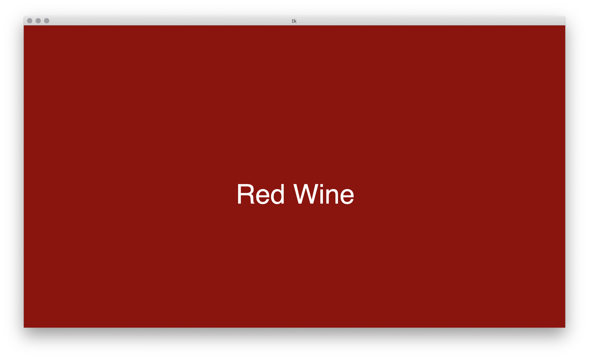
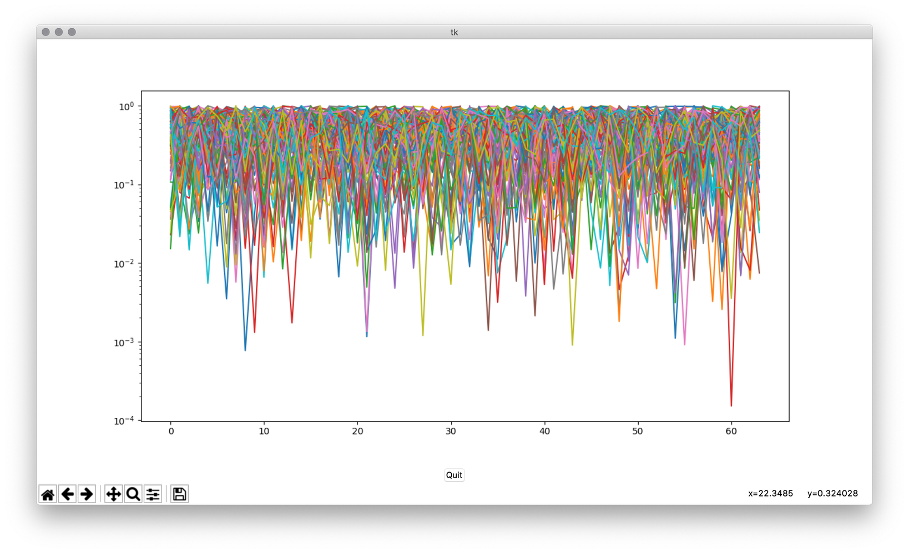

# Demo Setup
For a demo there are two different files that can be used to graphically show the measurements and the classification results.
There is also a direct connection to OUI2 possible so that classification results and data such as current temperature are visualised in the HUD.

### demo.py
When running this program, a window will pop up showing the classification result or “No Data” on no classification. 

When adding new classification classes, in order to show them in demo.py the configuration dictionary at the start of the file needs to be edited.
Screenshot:

### demo_plot.py
This program shows the currently measured data points from the e_nose sensor as a matplotlib graph.
Screenshot:

# Setting up a working demo!
For the demo to run the following files need to be started:
On the main PC:

→ demo.py (and/or demo_plot.py)

→ classifier_organizer.py 

On the Raspberry Pi connected to the e_nose sensor

→ python3 e_nose_node.py (for publishing e_nose data)

→ python3 bme680_nose.py (for publishing temperature/humidity data to OUI2)

### Note
At the finals live demo there was a problem with the connection of Publishers and Subscribers where even though the ROS_IP, etc/hosts, ROS_MASTER_URI etc where set correctly, Subscribers could only receive topics from Publishers when they were started BEFORE the Publishers. This meant that the files needed to be started in exactly the order given above.